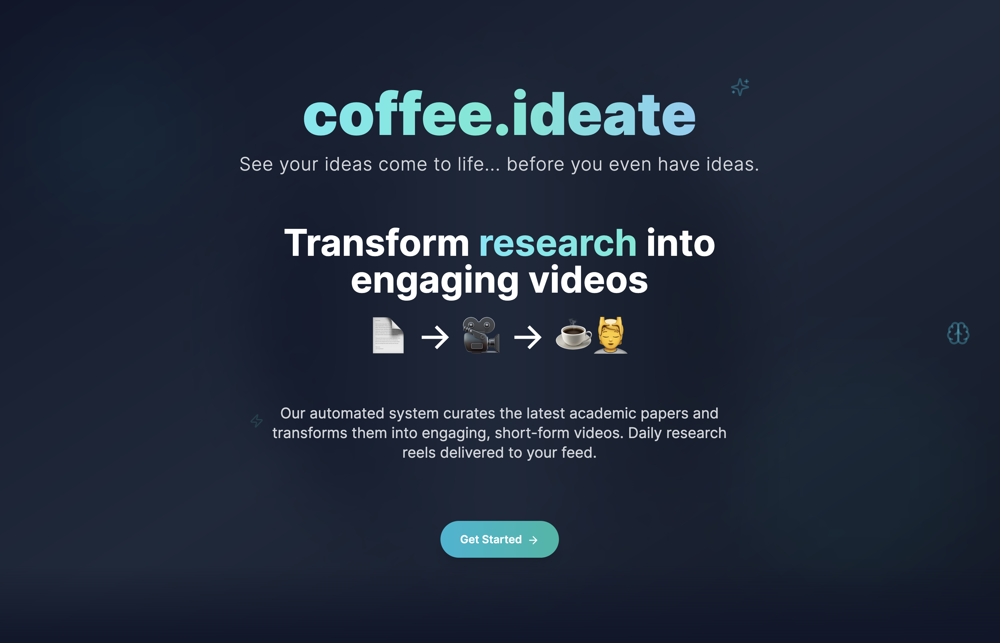
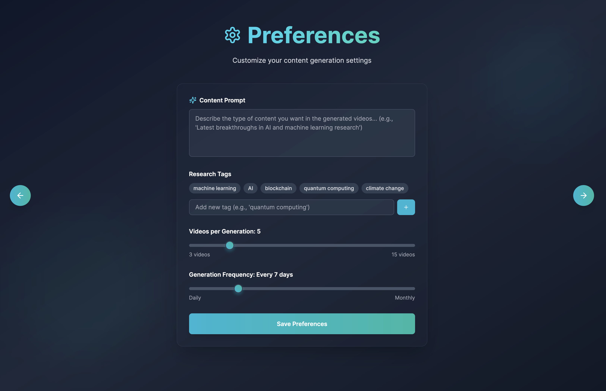
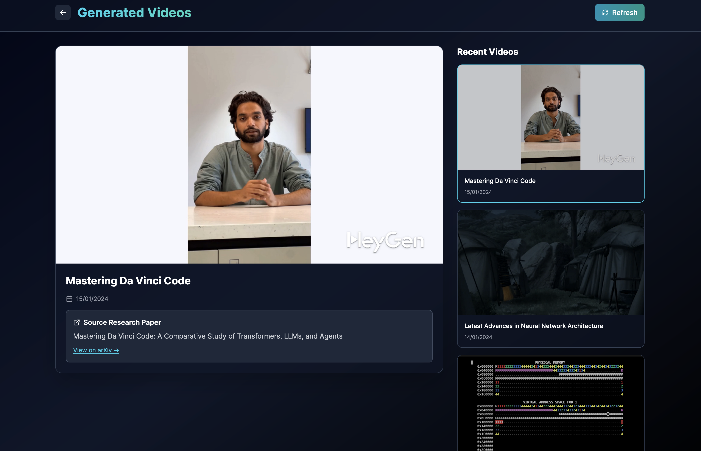

Project Overview – Daily Research Reels for Content Creators

We’re building an automated system that curates the latest academic papers (e.g., from arXiv) and transforms them into short, persona-narrated video scripts. Each script distills a paper’s core ideas into a structured, six-part storytelling format — including a hook, problem statement, solution, results, and impact.

The final output is a stream of short, AV-ready scripts that can be turned into engaging video reels. These reels are delivered daily to content creators, helping them discover fresh research ideas, stay ahead of trends, and create science/tech content faster and more creatively.

Think of it as a "research-to-reel" engine — turning dense academic writing into snackable, high-quality video content for creators, educators, and thought leaders.

📄→🎥→☕💆

- to run it run ```npm install``` then ```npm run dev```



